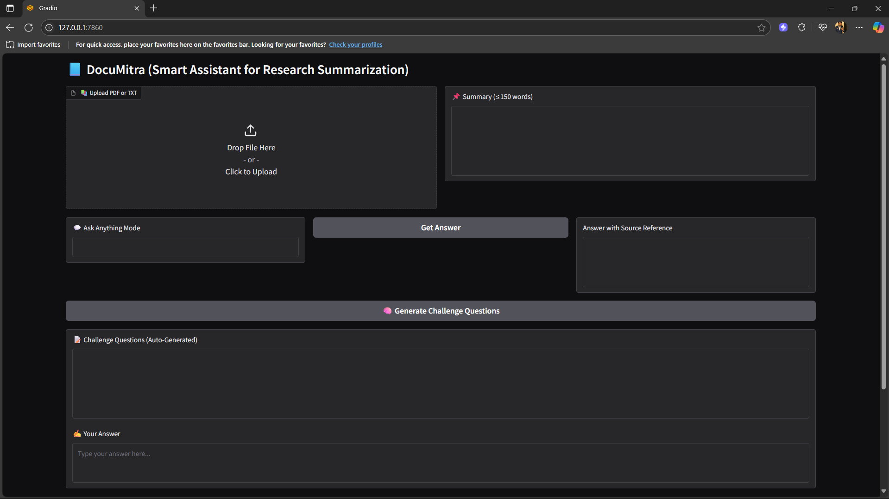
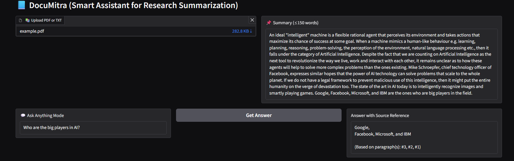

# 📘 DocuMitra - Smart Assistant for Research Summarization
DocuMitra is an AI-powered assistant that helps you deeply understand documents like research papers, manuals, and reports. It supports free-form QA, logic-based questioning, and justification with contextual references — all in one simple interface. This GenAI assistant processes uploaded PDF/TXT documents to:

- Generate a 150-word summary.
- Answer any user question (Ask Anything) with citation from document.
- Pose 3 logic-based questions (Challenge Me) and evaluate user's answers with justification derived from uploaded document.

## Approach
- Two pipelines can be set up - a fully-local system vs a cloud-API system.
- We approached it using fully-local system - Retrieval Augmented Generation, which embeds document chunks into vector store, retrieve relevant passages for each query, and feed those into a local LLM to generate answers.
- Used _PyMuPDF_ for Document Ingestion and Chunking.
- A single LLM was not sufficient for all three tasks and hence, we used a hybrid of 2 LLMs (_facebook/bart-large-cnn_ AND _deepset/roberta-base-squad2_).

## Challenges
- Handle sensitive data within the system without exposing to API providers - _Solved by using fully-local approach_.
- Single small model was not effective for all tasks - _Solved by using hybrid of two models_.
- facebook/bart cannot process long text all at once for summary - _Solved by dividing documents into smaller parts --> generating summary for each part --> then combining each summary at last and displaying the combined result._

## 🚀 Features
- 📚 Supports both .pdf or .txt documents.
- 📌 Concise Summary Generation.
- 💬 Context-aware answers grounded in the uploaded document.
- 🧠 Logic question generation and grading.
- **No hallucination policy**: All answers are grounded in the document.
- Clean UI using Gradio.
- No third party data leaks due to local operation.

## Technologies and Models Used
- Gradio: For building the interactive front-end UI
- PyMuPDF (fitz): For extracting text from PDFs
- Sentence Transformers: **_all-MiniLM-L6-v2_** for generating embeddings
- FAISS: Vector similarity search for information retrieval
- HuggingFace Transformers:  1)**_facebook/bart-large-cnn_** for summarization. 2)**_deepset/roberta-base-squad2_** for question answering.
- LangChain: _**RecursiveCharacterTextSplitter**_ for document chunking

## Setup Instructions

Clone the repo

```bash
git clone https://github.com/utkarsh-tekriwal/DocuMitra
cd DocuMitra
```

Create Virtual Environment

```bash
python -m venv venv
source venv/bin/activate  # Or venv\Scripts\activate on Windows
```

Install the required libraries

```bash
pip install -r requirements.txt
```


Run the app:

```bash
python app.py
```

Note: The assistant runs locally on machine, while using it for the first time it requires an active internet connection to download all large LLMs to your system. It may take a while depending on your internet connection. Please be patient at the first setup. Once all done, subsequent use of model will no longer require an internet connection and will be relatively fast.

Once the app is successfully executed, a localhost link will be generated in CMD, copy the link and access it in your browser for the UI to the model. Don't terminate CMD till you are working on the model.

After opening the localhost link, upload the PDF/TXT file in the desired prompt and wait for summary. You can use other features also as and when needed.

## 🖼️ Demo Screenshots

  


## 📂 Folder Structure
<pre> ``` DocuMitra/ ├── app.py ├── requirements.txt ├── README.md ├── .gitignore │ ├── sample_docs/ │ ├── example.pdf │ └── example.txt │ ├── demo_screens/ │ ├── UI.png │ └── ask_anything.png ``` </pre>
